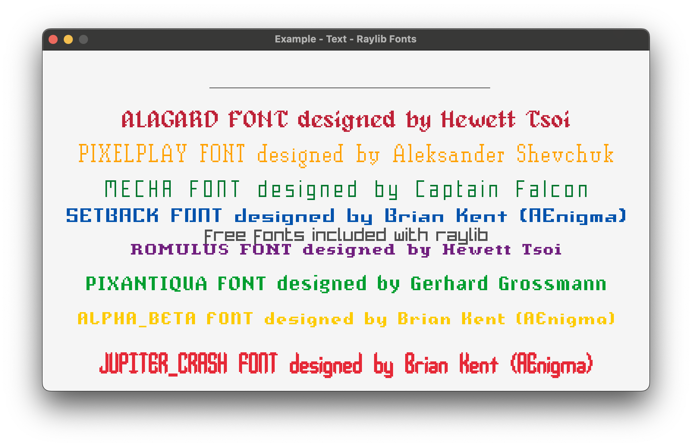
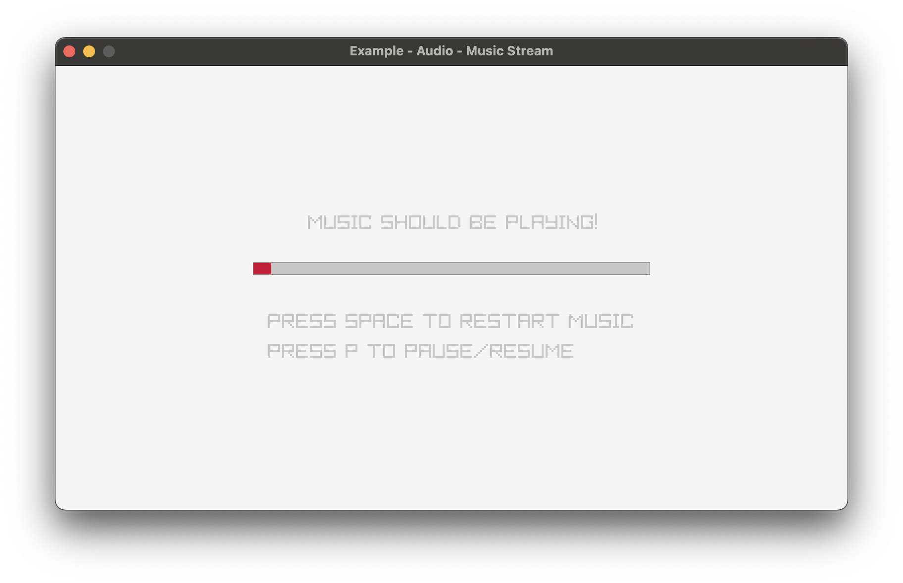
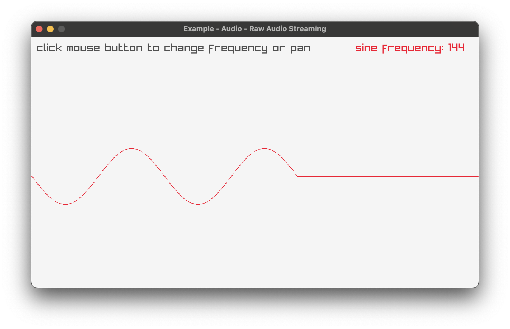
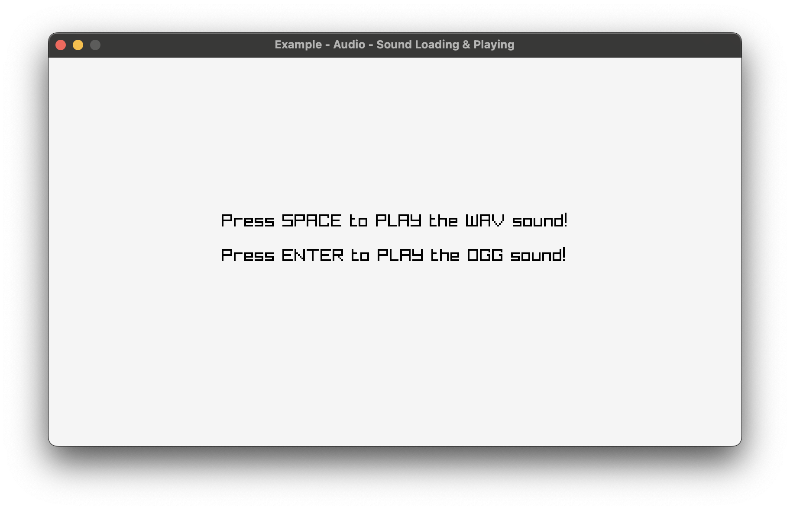
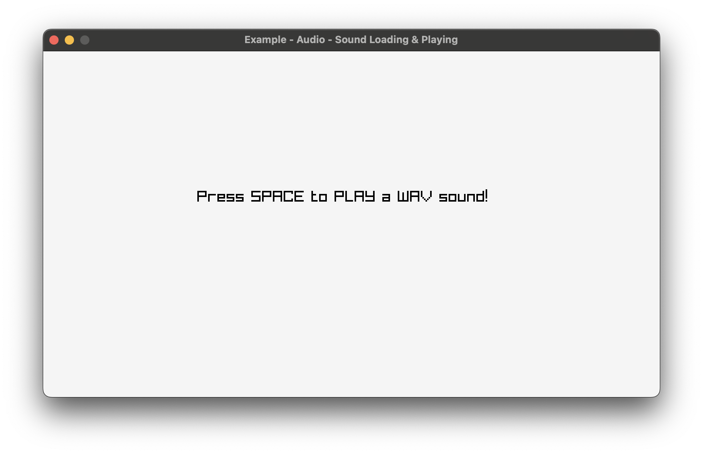

# [Swift Raylib](https://github.com/Lancelotbronner/swift-raylib) Examples

As always contributions are welcome, feel free to send new examples or translate missing ones from [raylib](https://github.com/raysan5/raylib/tree/master/examples) or [raylib games](https://github.com/raysan5/raylib-games/tree/master)!

## Table of Contents

- 🧱 Core
    - [2D Camera](#2d-camera)
    - [2D Camera Mouse Zoom](#2d-camera-mouse-zoom)
    - [2D Camera Platformer](#2d-camera-platformer)
    - [3D First Person](#3d-first-person)
    - [Basic Window](#basic-window)
    - [Drop Files](#drop-files)
    - [Input Keys](#input-keys)
    - [Input Mouse](#input-mouse)
    - [Input Mouse Wheel](#input-mouse-wheel)
    - [Letterboxed Window](#letterboxed-window)
    - [Scissor Test](#scissor-test)
- 🔺 Shapes
    - [Basic Shapes](#basic-shapes)
    - [Bouncing Ball](#bouncing-ball)
    - [Color Palette](#color-palette)
    - [Following Eyes](#following-eyes)
- 🖼 Textures
	- [Atlas](#atlas)
	- [Blend Modes](#blend-mode)
    - [Image Generation](#image-generation)
    - [Logo Raylib](#logo-raylib)
    - [Sprite Animation](#sprite-animation)
- 💬 Text
	- [Fonts](#fonts)
- 📦 Models
- 🖌️ Shaders
- 🔊 Audio
	- [Module Playing](#module-playing)
	- [Music Stream](#music-stream)
	- [Raw Audio Streaming](#raw-audio-streaming)
	- [Sound Loading](#sound-loading)
	- [Sound Multi](#sound-multi)
- 👾 Classics
    - [Arkanoid](#arkanoid)
    - [Platformer](#platformer)
    - [Snake](#snake)
- 🎮 Games

## 🧱 Category: Core

Examples using raylib core platform functionality like window creation, inputs, drawing modes and system functionality.

### [Basic Window](Sources/Core/Basic%20Window)

Written by ![C] [ray], translated by ![Swift] [Lancelot]

### [Input Keys](Sources/Core/Input%20Keys)

Written by ![C] [ray], translated by ![Swift] [Lancelot]

### [Input Mouse](Sources/Core/Input%20Mouse)

Written by ![C] [ray], translated by ![Swift] [Lancelot]

### [Input Mouse Wheel](Sources/Core/Input%20Mouse%20Wheel)

Written by ![C] [ray], translated by ![Swift] [Lancelot]

### [2D Camera](Sources/Core/2D%20Camera)

Written by ![C] [ray], translated by ![Swift] [Lancelot]

### [2D Camera Mouse Zoom](Sources/Core/2D%20Camera%20Mouse%20Zoom)

Written by ![C] [ray], translated by ![Swift] [Lancelot]

### [2D Camera Platformer](Sources/Core/2D%20Camera%20Platformer)

Written by ![C] [avyy], translated by ![Swift] [Lancelot]

### [Letterboxed Window](Sources/Core/Letterboxed%20Window)

Written by ![C] [Anata], translated by ![Swift] [Lancelot]

### [Drop Files](Sources/Core/Drop%20Files)

Written by ![C] [ray], translated by ![Swift] [Lancelot]

## 🔺 Category: Shapes

Examples using raylib basic 2D drawing functionality like various shape drawing, colors and gradients.

### [Basic Shapes](Sources/Shapes/Basic%20Shapes)

Written by ![C] [ray], translated by ![Swift] [Lancelot]

### [Bouncing Ball](Sources/Shapes/Bouncing%20Ball)

Written by ![C] [ray], translated by ![Swift] [Lancelot]

### [Color Palette](Sources/Shapes/Color%20Palette)

Written by ![C] [ray], translated by ![Swift] [Lancelot]

### [Following Eyes](Sources/Shapes/Following%20Eyes)

Written by ![C] [ray], translated by ![Swift] [Lancelot]

## 🖼 Category: Textures

Examples using raylib image functionality like texture drawing, image manipulation and image generation.

### [Image Generation](Sources/Textures/Image%20Generation)

Written by ![C] [ray], translated by ![Swift] [Lancelot]

### [Logo Raylib](Sources/Textures/Logo%20Raylib)

Written by ![C] [ray], translated by ![Swift] [Lancelot]

### [Blend Modes](Sources/Core/Blend%20Modes)

Written by ![C] [Karlo Licudine], translated by ![Swift] [Lancelot]

## 💬 Category: Text

Examples using raylib text functionality like loading fonts and rendering text.

### [Fonts](Sources/Text/Fonts)

Written by ![C] [ray], translated by ![Swift] [Lancelot]

## 📦 Category: Models

## 🖌️ Category: Shaders

## 🔊 Category: Audio

### [Module Playing](Sources/Audio/Module%20Playing)

Written by ![C] [Ray], translated by ![Swift] [Lancelot]

### [Music Stream](Sources/Audio/Music%20Stream)

Written by ![C] [Ray], translated by ![Swift] [Lancelot]

### [Raw Stream](Sources/Audio/Raw%20Stream)

Written by ![C] [Ray], translated by ![Swift] [Lancelot]

### [Sound Loading](Sources/Audio/Sound%20Loading)

Written by ![C] [Ray], translated by ![Swift] [Lancelot]

### [Sound Multi](Sources/Audio/Sound%20Multi)

Written by ![C] [Ray], translated by ![Swift] [Lancelot]

## 👾 Category: Classics

Classics implemented using raylib!

### [Arkanoid](Sources/Classics/Arkanoid)

Written by ![C] [ray], translated by ![Swift] [Lancelot]

### [Snake](Sources/Classics/Snake)

Written by ![C] [ray], translated by ![Swift] [Lancelot]

## 🎮 Category: Games

<!-- Footnotes & References -->

[ray]: https://github.com/raysan5
[lancelot]: https://github.com/Lancelotbronner
[avyy]: https://github.com/avyy
[Anata]: https://github.com/anatagawa
[Karlo Licudine]: https://github.com/accidentalrebel

[C]: Assets/icons/c.png
[Swift]: Assets/icons/swift.png
